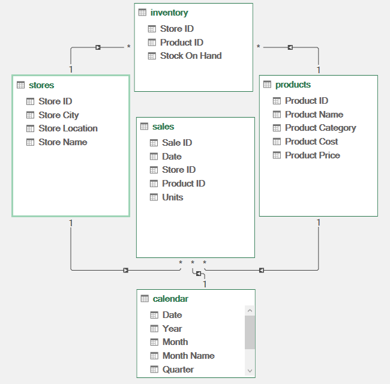
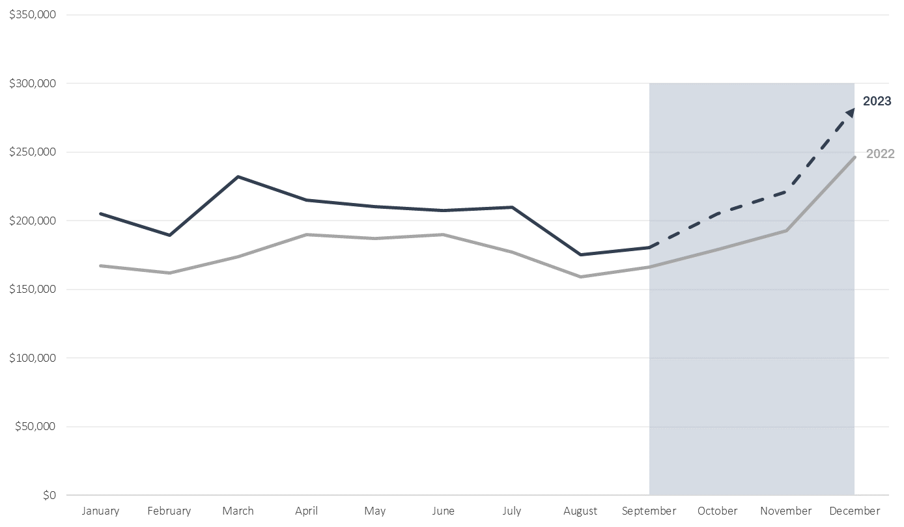
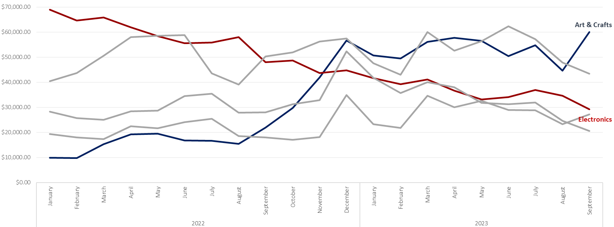
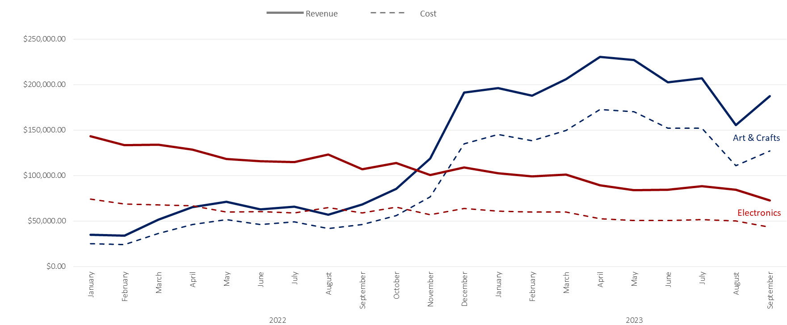
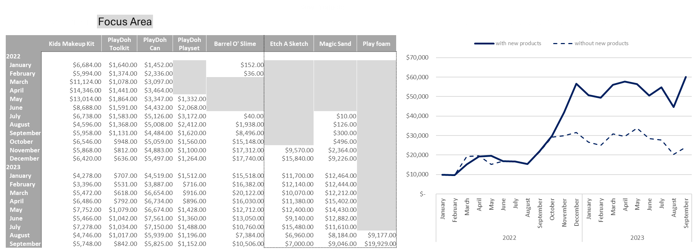
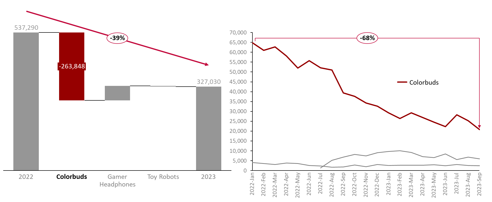
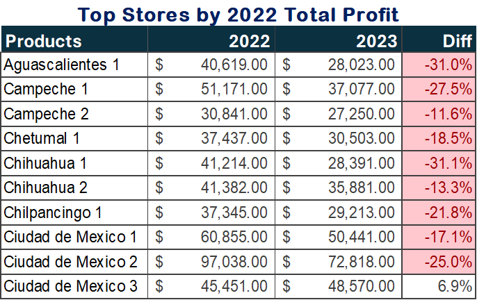
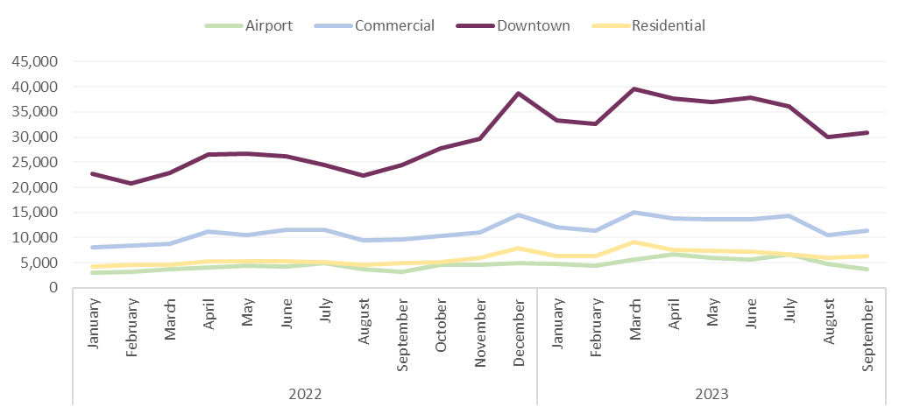

# Financial Overview for Maven Toys' 4th Executive Meeting
## Excecutive Summary

This report provides a comprehensive analysis of Maven Toys’ financial performance as to be reviewed during the 4th Executive Meeting. It highlights key trends, achievements, and areas requiring attention across different product categories, focusing on revenue, costs, and profitability.  

### **Key Highlights**  

1. **Revenue Growth**  
   - Maven Toys experienced stable revenue growth across several categories, with **Arts & Crafts** demonstrating the most significant surge of **300% increase in Q4 2022** due to successful new product introductions.  
   - Revenue in **Electronics** showed a decline a steep **42% decrease**, driven by the underperformance of its top product, **ColorBuds**.  

2. **Profitability Trends**  
   - Overall profits are forecasted to increase by **16% in 2023**, surpassing 2022's performance. This growth is attributed to strategic cost optimizations and product diversification.  
   - **Arts & Crafts** emerged as a key driver of profit growth, while **Electronics** faced challenges with declining profit margins.

3. **Cost Analysis**  
   - Cost trends closely mirrored revenue patterns, particularly in **Arts & Crafts** and **Electronics**. However, cost-efficiency measures have helped maintain healthy profit margins overall.  

4. **Product Performance**  
   - The addition of new products to the **Arts & Crafts** category has significantly boosted its market share.  
   - The **Electronics** category, led by ColorBuds, continues to struggle due to a steady decline in its profitability 
   since launch.

5.  **Store Performance**
      -  Underperforming Stores: Top stores like Aguascalientes 1 (-31%), Campeche 1 (-27.5%), and Ciudad de Mexico 2 (-25%) have seen notable profit declines, calling for localized strategies.
      - Bright Spot: Ciudad de Mexico 3 is an exception, showing a 6.9% growth in total profit.

### **Recommendations**  

- **Focus on Arts & Crafts Expansion**: Continue investing in this category, leveraging the momentum created by new product introductions.  
- **Revitalize Colobuds**: Launch targeted marketing campaigns and consider product redesigns to revive the top performing product.  
- **Enhance Cost Management**: Implement stricter cost controls to ensure sustained profitability while scaling operations.  
- **Monitor Market Trends**: Stay ahead of market dynamics to identify emerging opportunities and risks early.
- **Store-Specific Campaigns**: Tailor marketing strategies to underperforming stores based on local customer preferences. 
 
## Introduction

Welcome to Maven Toys’ 4th Executive Meeting Financial Report, where we review the company’s performance, assess financial health, and outline strategies for continued growth. This report captures the essence of Maven Toys' journey over the past fiscal year, presenting a comprehensive analysis of revenue streams, profitability drivers, and cost management practices.  

In today’s competitive market, maintaining financial agility is vital to staying ahead. This report not only provides a detailed breakdown of key financial metrics such as *Profit and Sales* but also highlights emerging opportunities and challenges across our diverse product categories. As we navigate an evolving business landscape, the insights presented here will serve as the foundation for informed decision-making and strategic planning.

---

### **Background**  

Since its founding, Maven Toys has been committed to delivering innovative, high-quality products that captivate audiences of all ages. From Arts & Crafts to Electronics, our product portfolio reflects a diverse offering aimed at catering to a global market.  

In 2022, we laid the groundwork for expansion, introducing new products and enhancing operational efficiencies. These efforts have begun to bear fruit, with some categories—such as Arts & Crafts—outperforming expectations. However, challenges remain, particularly in the Electronics category, where flagship products like ColorBuds have struggled to sustain profitability.  

This meeting comes at a pivotal time. With 2023 projected to exceed 2022’s profit performance by 16%, Maven Toys stands on the cusp of significant growth. The following report delves into the drivers behind this success and the hurdles that must be overcome to maintain our trajectory. It also provides actionable recommendations to ensure Maven Toys remains an industry leader in the years to come.

## Data Overview

The dataset was sourced directly from the sales teams across various store locations. It was carefully cleaned and structured using SQL to ensure accuracy, consistency, and readiness for in-depth analysis. This preprocessing step facilitated reliable insights into product performance, store profitability, and segment trends.

### Data Model Description

 

This image displays a data model with five tables: inventory, stores, sales, products, and calendar. Each table contains a set of columns with relationships linking them. Below is a detailed description of the columns, their use, and those not currently used but potentially useful for further analysis.

1. Stores Table 
Columns:
   - Store ID (Primary Key): Links to inventory and sales tables.
   - Store City: Could provide insights into sales performance by city.
   - Store Location: Useful for geographic-based analysis.
   - Store Name: Adds context to specific stores in reports.

2. Inventory Table 
Columns

   - Store ID: Links inventory to specific stores.
   - Product ID: Links inventory data to the products table.
   - Stock On Hand: Tracks inventory levels for specific products.

3. Sales Table 
Columns Used:

   - Sale ID (Primary Key): Unique identifier for each sale.
   - Date: Links sales to the calendar table for time-based analysis.
   - Store ID: Connects sales to specific stores.
   - Product ID: Links sales to specific products.
   - Units: Number of units sold in a transaction.

4. Products Table 
Columns Used:

   -  Product ID (Primary Key): Links to sales and inventory tables.
   - Product Name: Identifies products sold.
   - Product Category: Groups products into categories for aggregated analysis.
   - Product Cost: Unit cost of products.
   - Product Price: Unit price of products.

5. Calendar Table 
Columns 

   - Date (Primary Key): Links to the sales table for date-based filtering.
   - Year, Month, Month Name, Quarter: Enable time-series and trend analysis.

## Insights
### 2023 Forecasted to Surpass 2022 Total Profit with a Significant 16% Growth

   
- In 2022, the company experienced a strong close, achieving a massive profit spike in December of over **$240K**. This brought the annual profit to $2.189M, marking a highly profitable year overall.
- However, 2023 began with a lower-than-expected profit of just over **$200K** in January, reflecting the anticipated market seasonality trends. After a slight downturn, the market peaked in March with **$231K** in profit. This brought the Q1 total to **$625K**, showcasing a notable **24.5% increase** compared to Q1 2022.
- Mid-year, the market faced a steep decline, with August seeing the largest dip. By September 2023, total profits had reached **$1.824M—already 83% of 2022's full-year total**, despite the challenges and volatility experienced earlier.
- Looking ahead, Q4 is forecasted to see steady growth, culminating in a peak profit in December. By year-end, the total profit is expected to reach **$2.532M—representing a remarkable 16% growth** over 2022’s closing profit, highlighting the company's resilience and strategic adaptation to market trends.

### Despite 16% Overall Increase, Product Categories Show Uneven Contribution, with Some Experiencing Declines

 

- While three of the five product categories maintain relatively balanced movements along the profit line, two categories deviate significantly from this trend.
- Arts & Crafts experienced a dramatic spike, climbing from a total profit of **$15,448 in September 2022** to **$57,443 by December 2022**—a remarkable **300% increase in Q4**. Following this surge, the category stabilized, with profits fluctuating around this higher level.
- In contrast, the Electronics category has shown a steady decline. Once the most profitable category in January 2022, generating **$69,200 (71% of Maven Toys' profit for that month)**, it has since dropped to just over **$29,194—a steep 42% decrease**.
- These contrasting trends significantly influence total profit dynamics, highlighting the need for targeted attention to both categories.

### Cost Trends Mirror Revenue Patterns for Art & Crafts and Electronics

 

- Costs in Arts & Crafts and Electronics closely follow revenue trends, with Arts & Crafts showing scalable efficiency and Electronics highlighting potential inefficiencies.
- Cost trends for Art & Crafts and Electronics categories align closely with revenue increases, suggesting efficient cost management. However, the consistent rise in costs could indicate narrowing profit margins, pointing to a potential stabilization or slight decline in average profitability over time."

### Arts & Crafts Profit Surge Driven by New Product Additions

 

- New products in Arts & Crafts accounted for 65% of total profit growth in Q4 2022. going from September 2022 Profit of  **$15,448 to  a profit of $57,443 in December 2022 – a 300% increase within the quarter**. Stabilized profits in 2023, maintaining an average of **$55,000 per month** 

### The top electronics product, ColorBuds, has experienced a steady decline in total profit since its launch.

 

- ColorBuds, once the most profitable product in the Electronics category, has faced a **68% decline in total profit** since its launch, signaling the need for strategic intervention
- The decline in Colorbuds' total profit has significantly impacted the Electronics product category, contributing to a substantial **39% decrease in its overall profit**.
- Despite a significant decline in sales, Colorbuds remains the most profitable product category, contributing **74% of Q3 2023's total profit** and **13% of the total profit across all products**, solidifying its position as the highest revenue contributor.

### Significant Declines in Top 2022 Products' Sales in 2023

 

- Most of the top stores have experienced a significant decline in total profit in 2023 compared to 2022, with percentage drops ranging from **11.6%** (Campeche 2) to **31.1%** (Chihuahua 1).
- Campeche 1 and 2 as well as Chihuahua 1 and 2 both recorded declines, suggesting broader regional issues or shifts in consumer behavior.
- Exploring why Ciudad de Mexico 3 achieved growth while stores in the same location (Ciudad de Mexico 1 and 2) experienced decline .

### Consistent Total Sales Led by Downtown Locations' Strong Performance

 

- The Downtown segment remains the dominant contributor, with an average monthly total of around **30,000 units in 2023**.
- It witnessed a notable peak in December 2022 at approximately **42,000 units**, likely due to seasonal demand, followed by stabilization around **35,000 units in early 2023**
- other location categories show sales 
- The Downtown category showed a significant increase from early 2022 **(~25,000 units)** to late 2022 **(~42,000 units)**, representing a growth of **68%**. However, this was followed by a drop of approximately **16.7%** from the peak by September 2023
- The lack of growth in Residential and Airport segments suggests potential areas for improvement or alternative strategies.
## Challenges
1. **Declining Profitability in Top Products** 
Significant declines in total profit for key products such as Colorbuds **(-61%)**, Dart Gun **(-52%)**, and others highlight a downward trend in 2023, threatening overall profitability.
Electronics category experienced a **39%** drop in total profit, largely due to Colorbuds' decline.
2. **Market Saturation and Ineffective Branding** 
The decline in profit among high-performing products may indicate market saturation or ineffective branding and marketing strategies.
3. Underperforming Store Locations
Several store locations, like Aguascalientes 1 **(-31%)** and Campeche 1 **(-27.5%)**, have seen sharp declines in total profit, pointing to regional challenges.
4. **Uneven Performance Across Segments** 
The Downtown segment dominates sales but is showing signs of plateauing after a peak in late 2022. Other segments like Residential and Airport remain stagnant, limiting overall growth.
Cost Trends Aligning with Revenue
Rising costs in key categories like Art & Crafts and Electronics mirror revenue patterns, raising concerns about maintaining profitability as cost growth risks eroding margins.
5. **Lack of Strategic Focus on Growth Segments** 
Products and locations with untapped potential, such as Residential and Airport, are not being fully leveraged.
## Recomendation
1. **Product Rebranding and Marketing** 
Develop targeted rebranding campaigns for key products like Colorbuds, Dart Gun, and Kids Makeup Kit to reignite consumer interest.
Introduce innovative marketing strategies, such as bundling these products with complementary items or limited-time promotions.
2. **Product Portfolio Optimization** 
Assess underperforming products and consider phasing them out or redesigning them to align with market trends.
Introduce new products in Electronics and Art & Crafts categories that cater to emerging consumer demands.
3. **Enhance Store Performance** 
Analyze regional data to identify causes of declining profits in stores like Aguascalientes 1 and Campeche 1.
Implement location-specific strategies, such as promotions, local partnerships, or tailored product assortments.
4. **Leverage Downtown's Dominance** 
Focus on sustaining the Downtown segment by introducing exclusive products, loyalty programs, or experience-driven strategies to deepen customer engagement.
Use insights from Downtown's success to replicate best practices in underperforming segments like Airport and Residential.
5. **Cost Management Strategies**
Implement cost-control measures for Art & Crafts and Electronics to ensure profitability despite rising costs.
Negotiate with suppliers for better deals or explore alternative sourcing options.
6. **Explore Growth in Untapped Segments**
Invest in marketing and infrastructure to boost performance in Residential and Airport segments.
Develop tailored product lines or promotions specific to these underperforming areas.
7. **Seasonal and Promotional Alignment** 
Align inventory and marketing strategies with the seasonal peak observed in December across all categories to maximize sales during high-demand periods.

## Summary
The analysis reveals critical trends and challenges that highlight both opportunities and areas requiring immediate action. While certain products, like Colorbuds, remain key contributors to total profit despite declining sales, their performance underscores the need for targeted rebranding and marketing strategies. Additionally, the dominance of Downtown locations in sales and profit presents an opportunity to replicate successful practices in underperforming regions.  

The decline in profits across top-performing stores and product categories points to broader market shifts and operational inefficiencies that demand prompt intervention. Implementing data-driven strategies—such as focused promotional campaigns, inventory optimization, and customer engagement initiatives—will be essential to reversing these trends and driving sustainable growth in the coming fiscal periods.  

This report serves as a foundation for informed decision-making by you the key stakeholders, providing actionable insights to help Maven Toys remain competitive and adapt effectively to evolving market dynamics.

Powerpoint Presentation - [Financial Overview](Presentation.pptx)

--- 
> Note  
> This Data was actually gotten from  [Maven Analytics](https://mavenanalytics.io/)  
> The story is completely made up but the insight came from the actual data

Author - [Adejori Eniola Emmanuel](https://www.linkedin.com/in/adatamage/)